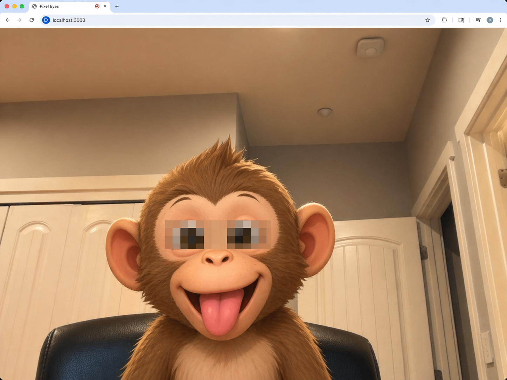

# Pixel Eyes

[Live Demo](https://davidyen1124.github.io/pixel-eyes/)

A very serious computer vision project for the modern age: open your webcam, detect your face, and slap a pixelated censor bar across your eyes in real time.

Because apparently "just seeing your face normally" was leaving performance on the table.

## What This Does

- Starts your webcam in the browser.
- Uses MediaPipe face landmarks to find both eyes.
- Draws a chunky pixelated strip across them.
- Rotates the strip so it follows your face instead of giving up immediately.

So yes, it is basically live privacy theater, but with decent tracking.

## Files

- `src/index.html`: one page, no drama
- `src/app.js`: webcam startup, face landmark detection, and the all-important eye obfuscation pipeline

## Technical Notes

- The app uses `@mediapipe/tasks-vision` from a CDN.
- The face landmarker model is also loaded remotely.
- It tracks one face at a time, which feels judgmental but keeps things simple.
- The effect is drawn on a fullscreen canvas over mirrored webcam video.

## Why

Unknown.

But if you needed a browser demo that makes everyone look like they are either under investigation or starring in the lowest-budget cyberpunk film ever made, this is surprisingly effective.
